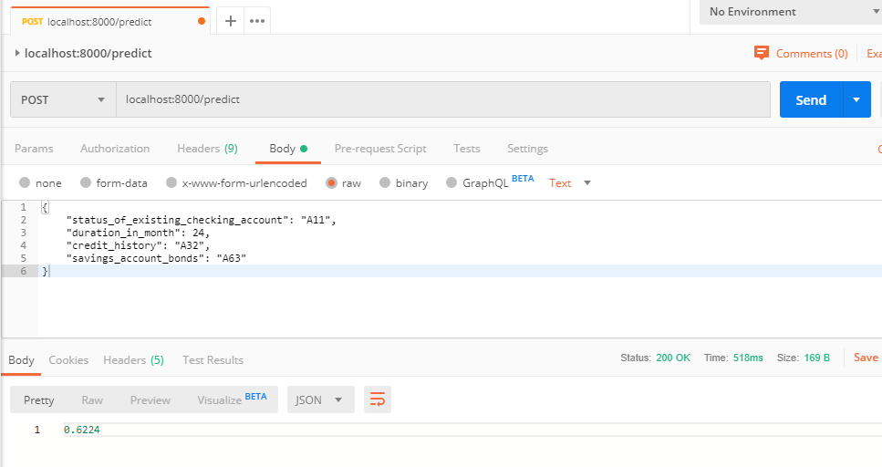

# RESTful APIs with Plumber

To get the API up and running in localhost, just run the R/run.R script and try the following command in the shell:

```
$ curl -X POST -d '{"status_of_existing_checking_account": "A11", "duration_in_month": 24, "credit_history": "A32", "savings_account_bonds": "A63"}' -H 'Content-Type: application/json' localhost:8000/predict
```

and you should get:

```
$ 0.6224
```
or you can use Postman:




# References

* [How to create a RESTful API for a machine learning credit model in R](https://www.knowru.com/blog/how-create-restful-api-for-machine-learning-credit-model-in-r/)
* [How to scale up RESTful APIs using Docker](https://www.knowru.com/blog/how-scale-r-restful-apis-using-docker/)
* [How to scale up credit model APIs using AWS](https://www.knowru.com/blog/how-to-scale-up-credit-model-apis-using-aws/)
